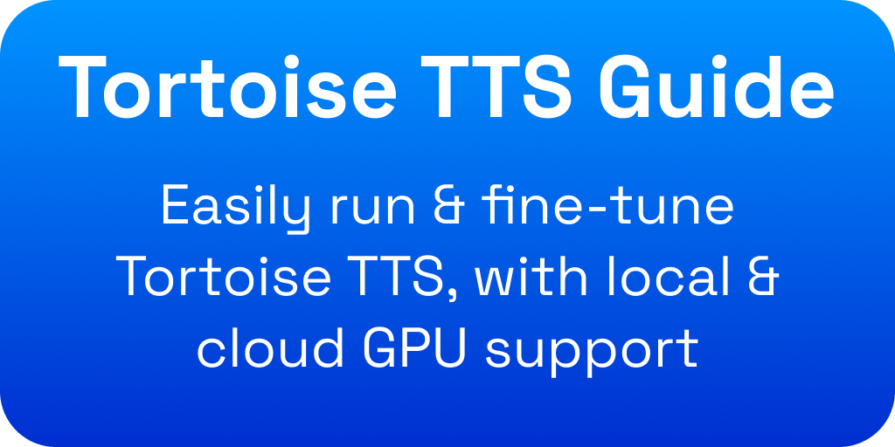

# tortoise-tts-guide

Tortoise (TorToiSe) TTS is one of the best TTS (text-to-speech) programs available. In fact, it is even rumored to power the popular ElevenLabs TTS service.

The goal of this is to make Tortoise TTS accessible for all, without having to pay for ElevenLabs!

Tortoise TTS is remarkably slow, however there are several enhancements we can use to speed it up.

Before we begin: I do NOT endorse any repo/website/etc linked here. USE AT YOUR OWN RISK!!!

## Demo

"The Raven" by Edgar Allan Poe. Generated using voice `train_dotrice`.

<a href="https://github.com/fakerybakery/tortoise-tts-guide/raw/main/raven.mp3" download>Download File</a>

I generated this on a free Colab instance.

## Introduction

Tortoise TTS recently gained a new maintainer, @manmay-nakhashi. Before becoming the Tortoise maintainer, he created [`tortoise-tts-fastest`](https://github.com/manmay-nakhashi/tortoise-tts-fastest), a fork of [`tortoise-tts-fast`](https://github.com/152334H/tortoise-tts-fast). The author of `tortoise-tts-fast`, @152334H, [works for ElevenLabs](https://github.com/152334H) and created a forked version of [`DL-Art-School`](https://github.com/152334H/DL-Art-School). `DL-Art-School` was originally created by the author of Tortoise TTS, however he did not release finetuning code due to ["ethical"](https://github.com/neonbjb/tortoise-tts/discussions/292#discussioncomment-4876055) and legal concerns. The forked version supports finetuning Tortoise TTS, which we will use in the fine-tuning section. Fine-tuning requires a certain DVAE model, which the author meant to keep from the public, but he accidentally pushed the model to HuggingFace (and later deleted it). Oops! Thankfully, various people have saved archives of the model, **and it's still available in the Hugging Face commit history.** You can download the model [here](https://huggingface.co/jbetker/tortoise-tts-v2/resolve/3704aea61678e7e468a06d8eea121dba368a798e/.models/dvae.pth) (open an Issue if the link goes down), but you won't need it because it will automatically be downloaded when needed. But feel free to archive a copy.

## Note

If any of these repositories becomes unavailable, please open an Issue (I've tried to archived most of them)

## Before you start

If you don't have a CUDA GPU, this may not work.

## Easy GUI for Inference + Training Interface

This is the easiest way to train + use the interface.

<a target="_blank" href="https://colab.research.google.com/github/fakerybakery/tortoise-tts-guide/blob/main/mrq_colab.ipynb">
  
</a>

## Inference

Basically, if you want a simple GUI, use the section above.

**COMING SOON:** How to load a custom model

To start Inference, we will use `tortoise-tts-fastest`. Another possibility is to use [this solution](https://git.ecker.tech/mrq/ai-voice-cloning/) (which I have tested for inference)

Click the button below:

<a target="_blank" href="https://colab.research.google.com/github/fakerybakery/tortoise-tts-guide/blob/main/tortoise_tts_fast.ipynb">
  
</a>

[Non-Colab/Other GPU: Download notebook](https://raw.githubusercontent.com/fakerybakery/tortoise-tts-guide/main/tortoise_tts_fast.ipynb)

(The notebook now works after much tweaking.)

On a free colab, generating the first stanza of The Raven by Edgar Allan Poe (9 seconds) took around 24 seconds. Not the fastest, but much better than before.

Fill out all the forms (`text` is the text you want it to say)

Select a GPU (in the menu, go to `Runtime` > `Change runtime type` > `Hardware accelerator`. Select `GPU`. Click `Save`.

Press the run/play button next to each cell. Listen to the audio.

### Longform Audio

Making an audiobook? After the `text` and `preset` section, create a new Code cell:

```python
text = """
your
multiline
audiobook
"""
trimmed_lines = [line.strip() for line in text.strip().split('\n') if line.strip()]
```

Then, make another Code cell:

```python
audio_list = []
voice = 'train_dotrice' #@param {type:"string"}
for txt in trimmed_lines:

    #@markdown Load it and send it through Tortoise.
    voice_samples, conditioning_latents = load_voice(voice)
    gen = tts.tts_with_preset(txt, voice_samples=voice_samples, conditioning_latents=conditioning_latents, 
                              preset=preset)
    audio_list.append(gen.squeeze(0).cpu())
concatenated_audio = torch.cat(audio_list, dim=1)
torchaudio.save('generated.wav', concatenated_audio, 24000)
IPython.display.Audio('generated.wav')
```


## Fine-Tuning

Basically, if you want a simple GUI, use the section above.

Custom-tuning coming soon...

## Resources

- [Tortoise TTS](https://github.com/neonbjb/tortoise-tts)
- [Tortoise TTS Fast](https://github.com/152334H/tortoise-tts-fast)
- [Tortoise TTS Fastest](https://github.com/manmay-nakhashi/tortoise-tts-fastest)
- [DL Art School](https://github.com/neonbjb/DL-Art-School)
- [DL Art School Fork for Tortoise TTS](https://github.com/152334H/DL-Art-School)
- [Tortoise TTS on Hugging Face](https://huggingface.co/jbetker/tortoise-tts-v2)
- [Tortoise TTS DVAE Download](https://huggingface.co/jbetker/tortoise-tts-v2/resolve/3704aea61678e7e468a06d8eea121dba368a798e/.models/dvae.pth)

## About

This is a multi-part work-in-progress series about running + finetuning tortoise TTS. If you're serious about finetuning it, please consider using a non-colab GPU.

## License

This document and all modifications to the notebooks are licensed under CC-BY-NC-SA 4.0. If you want to use these materials for commercial purposes (e.g. making an audiobook/podcast/etc), please open an Issue. For attribution, please add attribution in the audio itself.
